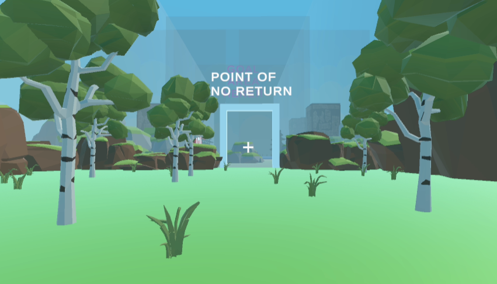
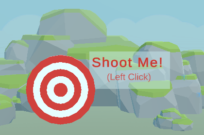

# First Person Shooter Unity Assignment

Created for COMP 521 - Modern Computer Games. Made using Unity/C#.

Watch a demo [here](https://www.youtube.com/watch?v=FVWS2cOupnk&t=16s&ab_channel=Lian)!

Requirements included:
1. A starting area, where the player can explore and move around freely
2. A combat area, where the player must destroy a target to proceed further
3. A canyon, with a randomly generated safe path and deadly path
4. A goal area

### Controls:
- **Arrow Keys and Mouse:** Move with arrow keys, click to shoot in the combat area!

### Screenshots:

                         

